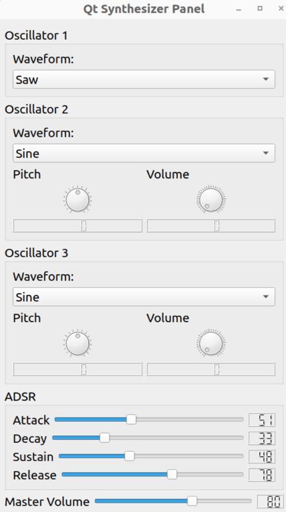
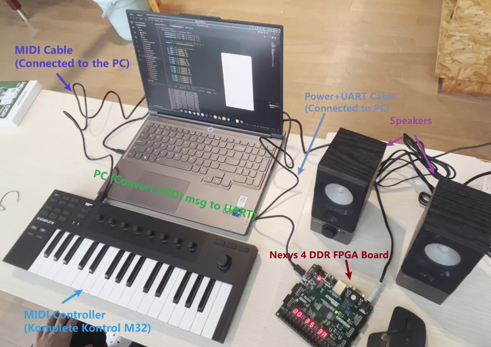

# Fynthesizer

Fynthesizer is a 3xOSC-like FPGA synthesizer that generates waveforms using up to 3 oscillators and allows you to play up to 12 keys simultaneously. You can fine-tune various parameters, such as **ADSR, pitch offset of secondary oscillators, volume**, and more to shape the waveform.

A MIDI controller is supported, but you may need to modify the hard-coded MIDI messages in the top modules to adapt to your controller. This project uses the Native Instrument Komplete Kontrol M32.

We have provided a GUI panel in `res/QtSynth.py`. The panel interface is shown below, displaying the adjustable parameters.



For more details and specifications, please refer to [Final_Report.pdf](doc/Final_Report.pdf).

## Environment

- **FPGA board:** Nexys DDR4 (Nexys A7)
- **FPGA chip:** xc7a100tcsg324-1
- **Operating system:** Ubuntu 20.04 (full project with test cases), Windows 11 (partial test cases. To run on Windows, modify `res/QtSynth.py` which uses the **pySerial** library)
- **Development environment:** Vivado 2020.2

## Hardware Connection



Recommendation: Use a single-channel-to-dual-channel 3.5mm jack to ensure both speakers play sound.

## Usage

Clone this project and use the `.bit` and `.bin` files in the `bitstream/` folder to program your device. Alternatively, download the project file from the GitHub Release and open the Vivado project directly.

To compile this project in Vivado:

1. Add all files in `src/hdl` as source files.
2. Add all files in `src/xdc` as constraint files.
3. Choose one of the top module `.vhd` files in `src/hdl/top_modules` and set the corresponding `.xdc` file in `src/xdc` as target.

The provided top modules are:

- `Fynthesizer3x.vhd`: 3xosc-like synthesizer **(Recommended)**
- `Fynthesizer3x_inst.vhd`: 3xosc-like synthesizer with musical instrument waveforms **(Recommended)**
- `Fynthesizer.vhd`: Single oscillator synthesizer
- `core_top.vhd`: Test file for the synthesizer core, controlled by the 4 buttons and 16 switches on the board
- `instrument_top.vhd`: Test file for the synthesizer core with instrument waveforms, controlled by the 4 buttons and 16 switches on the board


For the Python files provided in `res`:

```sh
cd res
```

First, install the dependencies:

```sh
pip install mido serial pyqt5
```

Then, to call the Qt panel:

```sh
# If you set Fynthesizer3x as the top module
python QtSynth.py

# If you set Fynthesizer3x_inst.vhd as the top module
python QtSynth_inst.py
```

These two panels only differ in the labels in the waveform selection boxes.

If you don’t have a MIDI controller, you can use the Virtual MIDI Piano Keyboard (vmpk) instead.

```
sudo apt install vmpk
```

To play a MIDI file directly to the synthesizer:

```sh
python play_midi_file.py
```

## References

Thanks to the following projects for their inspiration and help:

- [docquantum/skrach-synth: An FPGA synthesizer with MIDI support](https://github.com/docquantum/skrach-synth)
- [jakubcabal/uart-for-fpga: Simple UART controller for FPGA written in VHDL](https://github.com/jakubcabal/uart-for-fpga)

## Contributors

<a href="https://github.com/Tangent-H">
  
</a>

<a href="https://github.com/VivianChencwy">
  
</a>

